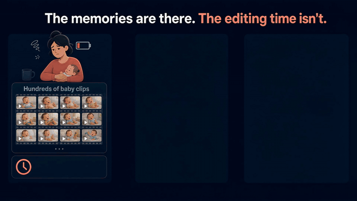
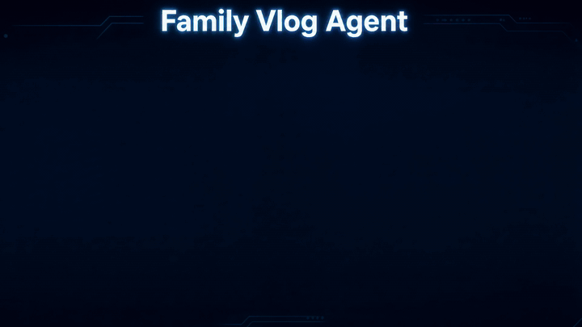

<p align="center">
  
</p>

# Family Vlog Agent

**Turn selected family clips into a structured, locally rendered Vlog—without manually reviewing and editing every source.**

Built for the [All Things Agentic Hackathon](https://allthingsagentichackathon.devpost.com/) · **Taskmaster category** · Android

Demo video: [Watch the public demo on YouTube](https://www.youtube.com/watch?v=y6o_GCJuzhM)

Public Google Cloud verification: [Open the Cloud Run service](https://family-vlog-evidence-513339907677.us-central1.run.app/) · [View the frozen aggregate evidence](https://family-vlog-evidence-513339907677.us-central1.run.app/v1/evidence/latest)

## Project Key Metrics

*Real-device case featured in the demo video.*

| Metric | Result |
| --- | --- |
| Content analysis and selection | **4** original clips uploaded → **11** events identified → **5** related events selected by the AI editor |
| Video duration | **46.8 s** of source footage → **20.9 s** final edit |
| Task timing | **3 min 40.3 s** to the original edit · **75.5 s** cumulative Cloud call spans · **23.2 s** post-plan local path through the optional subtitled copy |

*Timing note: These figures are not additive and use different endpoints: 3 min 40.3 s ends at the original output, 75.5 s sums seven Cloud request-to-choice spans, and 23.2 s ends at the later optional subtitled copy. Between Cloud calls, the phone prepared analysis windows, processed segments, read files, constructed requests, and handled network transfers.*

Review the [sanitized real-device Android and Google Cloud execution evidence](execution-evidence/README.md), including the full content-bearing Cloud activity snapshot, device JSON artifacts, event-selection comparison, output metadata, and exact timing definitions.

## Why I built it

I am a mother who treasures the ordinary moments that make a family life. I built Family Vlog Agent out of love for my family: the memories are already in our phones, but a growing collection of short videos can be difficult to revisit and shape into something we will actually watch.

This project turns that practical gap into an executed workflow. A parent chooses the source videos, asks for a Vlog once, and receives a local MP4 rather than an editing suggestion or a chat response.



## What it delivers

- Multi-video selection through Android Photo Picker.
- Adaptive preparation that keeps compatible original bytes when they fit, tries keyframe-aligned remuxed segments when needed, and creates an H.264/AAC proxy only as a final compatibility or request-budget fallback.
- Gemini video understanding with structured event IDs, descriptions, audio context, and time ranges.
- A separate JSON-only story-planning role that selects and orders validated events.
- Deterministic Kotlin restoration of authoritative source IDs and time ranges.
- Local Media3 trimming, sequencing, rendering, technical output inspection, and MediaStore publication.
- An H.264 local Vlog MP4, with AAC when the edit contains audio.
- An optional, separate on-device Chinese-English subtitle action after the original Vlog succeeds.

## Autonomous workflow

This is the Taskmaster flow. After source selection, the parent taps **Create Vlog** once. The foreground, user-started run then prepares inputs, understands footage, plans a story, executes the media edit, inspects the technical output, and publishes the result without step-by-step guidance. It does not listen or operate in the background.

1. **Select originals.** Photo Picker returns content URIs that remain under Android control.
2. **Probe and prepare.** Kotlin inspects tracks, duration, decoding, container MIME, readable metadata, and the inline-request budget. A source may remain whole or become multiple prepared inputs.
3. **Understand every prepared input.** Each prepared input gets its own fresh `video_understanding_agent`, fresh `InMemorySessionService`, and fresh `InMemoryRunner`. The model receives inline video followed by the understanding task and returns schema-constrained segment event JSON.
4. **Validate, remap, and merge.** Kotlin maps segment-relative times back to authoritative source coordinates and writes `video_understanding.json`.
5. **Plan exactly once from JSON.** One fresh `story_planning_agent` and one fresh `InMemoryRunner` receive only the merged understanding JSON and editing brief. This call has no video and no shared history. It returns event IDs, `story_role`, and `selection_reason`.
6. **Restore an executable plan.** Kotlin resolves every selected event against the validated understanding data and writes authoritative source/time fields into `edit_plan.json`.
7. **Edit locally.** Media3 reads the selected ranges from the original videos, renders the composition, and publishes the technically inspected MP4 through MediaStore.
8. **Optionally subtitle a separate copy.** The completed Vlog can enter a distinct on-device transcription, translation, and subtitle-rendering action. This is not another Gemini stage.

The model-call count is therefore **not fixed at two for an entire run**. There is one video-understanding call for every prepared input, followed by exactly one JSON-only story-planning call after all understanding results are merged.

## Architecture



The boundary is deliberate: Google-managed cloud services perform semantic video understanding and structured story planning; the custom Firebase model bridge, ADK orchestration, validation, source/time restoration, Media3 execution, storage, and final export remain in the Android application. The repository contains no project-owned cloud media store or remote renderer.

## Google technology mapping

The production workflow uses **ADK Kotlin Android 0.8.0** for agent development and orchestration. The Android runtime uses the **Agent Platform Gemini API** as its managed semantic backend, while **Cloud Run** hosts the project's public, read-only execution-evidence API.

| Responsibility | Shipped Google technology | What it does here |
| --- | --- | --- |
| Agent development and orchestration | ADK Kotlin Android 0.8.0 (`com.google.adk:google-adk-kotlin-core`) | Runs the named `video_understanding_agent` and `story_planning_agent`; every invocation receives a fresh `InMemoryRunner`, with no tools, memory, sub-agent routing, or shared history |
| Android model-access bridge | Firebase AI Logic (`com.google.firebase:firebase-ai`, Firebase BoM 34.17.0) through a custom ADK `Model` implementation | Reaches Agent Platform while preserving the existing Firebase `responseSchema`, `modelVersion`, cancellation, error, and ordered-content contract |
| Managed semantic backend | Agent Platform Gemini API | Serves `gemini-3.6-flash` in `global` for video understanding and JSON-only story planning |
| Public execution evidence | Cloud Run | Serves a read-only aggregate of the frozen real-device evidence and its immutable provenance hashes; it receives no Android telemetry or media |
| Deterministic device execution | Android Kotlin, Media3, MediaStore | Validates model references, restores source/time authority, edits original ranges, inspects the output, and publishes the local MP4 |

The implementation is directly visible in [`AdkModelClient.kt`](app/src/main/kotlin/com/chill/familyvlog/ai/AdkModelClient.kt), [`FirebaseAdkModel.kt`](app/src/main/kotlin/com/chill/familyvlog/ai/FirebaseAdkModel.kt), [`AnalysisInputProcessor.kt`](app/src/main/kotlin/com/chill/familyvlog/pipeline/AnalysisInputProcessor.kt), [`VlogPipeline.kt`](app/src/main/kotlin/com/chill/familyvlog/pipeline/VlogPipeline.kt), [`Media3Renderer.kt`](app/src/main/kotlin/com/chill/familyvlog/render/Media3Renderer.kt), and [`MediaStorePublisher.kt`](app/src/main/kotlin/com/chill/familyvlog/output/MediaStorePublisher.kt).

## Google Cloud execution evidence

A post-migration real-device run on **2026-08-26 UTC** produced **seven** consecutive `gemini-3.6-flash` traces in `global`: six video-understanding calls followed by one JSON-only story-planning call. The matching activity snapshot contains **21 content-bearing entries**—seven system messages, seven user requests, and seven model choices—and all seven choices ended with `finish_reason` `stop`.

The first Cloud request began at `2026-08-26T22:58:39.955685Z`; the final plan choice arrived at `2026-08-26T23:01:51.048492Z`. Their wall span is **191.092807 s**, while the sum of the seven observed request-to-choice spans is **75.535327 s**. Device-side JSON files were written **0.113421947 s** after the final choice, and the original MP4 file mtime followed **6.201421948 s** after that choice.

The [public evidence snapshot](execution-evidence/README.md) retains the full prompts, model responses, project/device identifiers, and trace/span/insert identifiers authorized for review. The Google account email, reusable credentials, and actual video/audio bytes are excluded. Six inline video inputs appear only as distinct SHA-512 fingerprints. The same directory contains the phone's unmodified app-UID `logcat`, final `video_understanding.json`, final `edit_plan.json`, MediaStore rows, file metadata, call summary, timing derivation, and checksums.

For a low-friction reviewer surface, the [public Cloud Run evidence endpoint](https://family-vlog-evidence-513339907677.us-central1.run.app/v1/evidence/latest) exposes only the frozen aggregate metrics, timing limitations, immutable evidence commit, and SHA-256 provenance. Its implementation is in [`cloud/evidence-api`](cloud/evidence-api/). This service is deliberately outside the Android production path: it does not ingest live telemetry, accept media, or participate in Vlog creation.

## Privacy boundary

- **Sent for video understanding:** the selected video's audio-visual bytes, either unchanged or represented by remuxed segments or a necessary H.264/AAC proxy; readable source metadata; and the understanding task. Readable metadata can include date, location, title, author, and XMP when present.
- **Sent for story planning:** only the merged understanding JSON and editing brief. No video bytes, URI, file path, or previous model history are included in this request.
- **Kept on the phone by the product pipeline:** source content URIs, temporary remux/proxy files, final understanding and edit-plan JSON, render intermediates, and the MediaStore MP4. Authoritative source files are not uploaded to a project-owned object store, and there is no remote editing or rendering service.
- **Optional subtitles:** the completed Vlog is transcribed on-device with sherpa-onnx/SenseVoice, translated on-device with ML Kit after any required model download, rendered with libass through Media3, and published as a separate local MP4.
- **Cloud activity telemetry:** Firebase AI Logic monitoring can write sampled requests, responses, and inline media data to the project's `_Default` Cloud Logging bucket. The verified bucket retention at evidence capture was **30 days**. This project does not claim zero cloud retention, fully offline processing, or that private model responses never enter logs. See the official [Firebase AI Logic monitoring documentation](https://firebase.google.com/docs/ai-logic/monitoring).
- **Public Cloud Run evidence API:** the service publishes only a static aggregate summary and public, immutable repository links. It does not contain media bytes, prompts, model responses, private device/account identifiers, local paths, private content URIs, or trace/span identifiers, and it exposes no mutating route. Cloud Run can still produce ordinary platform request logs for endpoint access.
- **Outside the app boundary:** a device, gallery, or viewer may sync local media according to the user's system and account settings.

## Technical implementation

### Structured two-stage contract

| Stage | Invocation pattern | Model input | Structured output | Deterministic next action |
| --- | --- | --- | --- | --- |
| Video understanding | Once per prepared input; fresh `video_understanding_agent` and Runner | One inline original or derived video input, source-window metadata, then the understanding task | Segment event JSON with IDs, relative times, descriptions, and optional audio descriptions | Kotlin validates, remaps, and merges into `video_understanding.json` |
| Story planning | Exactly once after merge; fresh `story_planning_agent` and Runner | Only `video_understanding.json` plus the editing brief | Event IDs, `story_role`, and `selection_reason` | Kotlin restores source/time fields and builds `edit_plan.json` and the Media3 render specification |

Every model call is a new one-shot `generateContent` request. ADK uses `IncludeContents.NONE`, and the two roles are independent rather than a parent/child agent tree or routing system. The shared custom Firebase bridge keeps `application/json`, the exact Firebase response `Schema`, inline-video-before-text ordering, original bytes, `modelVersion`, cancellation, and the existing error mapping.

### Input and media execution

- A compatible source that is at most 40 minutes and fits the conservative inline budget is sent as original bytes.
- If it does not fit, the app first tries keyframe-aligned remuxed segments. It creates an H.264/AAC proxy only for unsupported container MIME or when even the smallest remux interval cannot fit.
- Kotlin resolves selected event IDs against validated understanding data; Gemini never receives file-operation authority.
- Media3 orders original source ranges in a `Composition`, fits them to the first clip's display aspect ratio, tone-maps HDR output to SDR when supported, mixes supported audio to stereo, and encodes H.264 with AAC when audio is present.
- A private cache MP4 is technically inspected, copied to a pending MediaStore row, committed, and exposed as a local content URI.

### Shipped stack

| Layer | Technology |
| --- | --- |
| Android application | Kotlin 2.2.10, Android API 36, Jetpack Compose, coroutines |
| Agent orchestration | ADK Kotlin Android 0.8.0 |
| Model access | Custom ADK `Model` bridge over Firebase AI Logic |
| Managed model backend | Agent Platform Gemini API, `gemini-3.6-flash`, `global` |
| Public evidence service | Cloud Run, read-only Flask/Gunicorn API |
| Structured contracts | Firebase response `Schema`, Kotlin JSON decoding, domain checks |
| Input preparation | Android `MediaExtractor`/`MediaMuxer`; Media3 Transformer for necessary proxies |
| Local edit and export | Media3 Transformer 1.11.0, Android MediaStore |
| Optional subtitles | sherpa-onnx 1.13.5, Silero VAD, SenseVoice, ML Kit Translation 17.0.3, ass-kt/libass, Noto Sans CJK |

The core workflow uses no external database, web search, social feed, Google Photos integration, or cloud media library. Its factual inputs are user-selected videos, their audio, and locally readable container metadata. The public Cloud Run evidence API is not called by the Android app and stores no live run telemetry. The optional subtitle feature uses locally packaged speech assets and an ML Kit translation model that may be downloaded when missing; those assets do not supply family facts or edit decisions.

## Reproduce and run

### 1. Prerequisites

- A Linux shell with Git, `curl`, `tar`, `unzip`, and GNU `od`; the subtitle setup script uses `od --endian=big`.
- JDK 17.
- Android SDK Platform 36 and Build Tools 36.0.0.
- An Android 16 / API 36 device with `adb`; the app's current `minSdk` is 36.
- A Firebase/Google Cloud project with billing, Firebase AI Logic configured for the Agent Platform Gemini API, access to `gemini-3.6-flash`, and an Android app registered as `com.chill.familyvlog`.
- The Google Cloud CLI and `jq` only when reproducing the metadata-only execution-evidence query.

The public evidence API is independent of the Android build. To run or deploy that service, follow [`cloud/evidence-api/README.md`](cloud/evidence-api/README.md).

### 2. Clone the repository

```bash
git clone https://github.com/qiuqiuaiweb3/family-vlog-agent-public.git
cd family-vlog-agent-public
```

### 3. Configure Firebase

Follow the official [Firebase AI Logic Android setup](https://firebase.google.com/docs/ai-logic/get-started?platform=android), select the Agent Platform Gemini API provider, and download the Android client configuration for `com.chill.familyvlog`:

```text
app/google-services.json
```

That file is Git-ignored; do not commit it. The dependency graph contains App Check core transitively through `firebase-ai`, but this repository does not declare or initialize an Android App Check debug or Play Integrity provider.

For the **owner's personal sideload on one owner-controlled Android phone**, or an **isolated evaluator reproduction project using non-sensitive test media**, and only **before November 2, 2026**, the current build can make model calls without a code change by temporarily configuring Firebase AI Logic as follows:

1. In Firebase console, open **Security > App Check > APIs**.
2. Open **Firebase AI Logic**, then start its setup workflow.
3. Set **Baseline protection** to **Unenforced (monitoring only)** and continue.
4. Set **Replay protection** to **Disabled**, continue, and confirm the change.

This is a short-term reproduction compromise, not a production or public-distribution security configuration. The Firebase project configuration and any APK configured with it must not be publicly distributed or used for external real users.

Starting **November 2, 2026**—or earlier if the console no longer permits enforcement to be removed—the current code by itself cannot complete Firebase AI Logic model calls. Integrate the [Android App Check debug provider](https://firebase.google.com/docs/app-check/android/debug-provider) for local development or [Play Integrity](https://firebase.google.com/docs/app-check/android/play-integrity-provider) for distribution, then enable or maintain enforcement. See the official [Firebase AI Logic App Check guide](https://firebase.google.com/docs/ai-logic/app-check).

### 4. Prepare required local assets

The build requires the local speech model, subtitle font, Google Translate attribution image, and repository-controlled license files even though subtitle creation is optional at runtime:

```bash
./scripts/setup-local-asr.sh
./scripts/setup-subtitle-assets.sh
```

The scripts place downloaded artifacts under Git-ignored `.local-asr/` and `.local-subtitle/` directories. Review [`THIRD_PARTY_NOTICES.md`](THIRD_PARTY_NOTICES.md) before building or distributing anything.

### 5. Run host checks and build APKs

```bash
./gradlew :app:mergeDebugAssets :app:testDebugUnitTest :app:lintDebug
./gradlew :app:assembleDebug :app:assembleDebugAndroidTest
```

The main debug APK is produced at:

```text
app/build/outputs/apk/debug/app-debug.apk
```

### 6. Install and launch

Use replacement installs so the application identity and existing grants remain intact:

```bash
adb install -r app/build/outputs/apk/debug/app-debug.apk
adb shell am start -n com.chill.familyvlog/.MainActivity
```

In the app:

1. Read and acknowledge the data disclosure.
2. Select one or more videos.
3. Tap **Create Vlog** and keep the app in the foreground.
4. After success, tap **Open Vlog** to hand the local MediaStore URI to an installed viewer.
5. Optionally request a separate Chinese-English subtitled copy after reviewing the original Vlog.

### 7. Optional non-visual device verification

Do not use Gradle `connected*AndroidTest` tasks because their cleanup can remove the two installed packages. Build and install the test APK manually, run instrumentation, and confirm both package paths:

```bash
adb install -r app/build/outputs/apk/debug/app-debug.apk
adb install -r -t app/build/outputs/apk/androidTest/debug/app-debug-androidTest.apk
adb shell am instrument -w -r com.chill.familyvlog.test/androidx.test.runner.AndroidJUnitRunner
adb shell pm path com.chill.familyvlog
adb shell pm path com.chill.familyvlog.test
```

These checks do not validate video content, sound, editing taste, subtitle quality, or the final viewing experience. Those require human playback and comparison with the selected sources.

## Learnings

1. **Do not compress by default.** Small compatible sources can retain original bytes. Keyframe-aligned remuxing preserves quality when segmentation is enough; lossy proxy generation is the final fallback.
2. **Separate perception from editorial judgment.** Video understanding and story planning have different evidence boundaries. Isolating them keeps the planning request JSON-only and auditable.
3. **Make model output executable through references.** The planning model selects validated event IDs instead of producing paths or guessed timestamps. Kotlin restores authoritative media coordinates before Media3 acts.
4. **Keep semantic autonomy and media authority separate.** ADK and Gemini make the semantic decisions; Android owns deterministic state, file access, cancellation, rendering, and publication.
5. **Local rendering is not an offline claim.** It avoids project-owned cloud media storage and remote rendering, while analysis, planning, and current monitoring telemetry still cross the cloud boundary.
6. **Technical checks cannot judge family-video quality.** Parseability, tracks, codec/container metadata, duration, dimensions, cancellation, and cleanup are automatable; truth, pacing, sound, subtitles, and the finished Vlog still require a person.

## Limitations

- The submitted build is a personal-use sideload for one Android phone controlled by the author. It is not a public consumer release, and the configured APK is not distributed.
- The app targets and requires Android API 36.
- Runs are foreground-only and do not resume across process death or device restart.
- Gemini analysis and planning require network access; optional ML Kit translation can require a model download over Wi-Fi.
- The product has no built-in manual timeline editor, cloud media library, remote renderer, or sharing flow.
- Model understanding and edit quality depend on the selected media and require human review. No unmeasured performance, speed, accuracy, or cost advantage is claimed.
- The public video and seven-call evidence cover the final ADK build. The Cloud Run endpoint publishes a frozen aggregate of that same evidence and remains separate from the Android runtime.
- This repository does not claim complete regulatory, privacy, trademark, or distribution compliance.

## Third-party and distribution notice

The optional subtitle stack includes software, models, fonts, and dynamic Google ML Kit assets with separate terms. The current APK is intended only for the author's personal sideloading. Known redistribution obligations for prebuilt sherpa-onnx and libass-related transitive components are not yet closed, so the APK must not be publicly distributed in its current form. See [`THIRD_PARTY_NOTICES.md`](THIRD_PARTY_NOTICES.md) and the license texts under [`third_party/`](third_party/) for the exact inventory and unresolved boundaries.

Google, Gemini, Firebase, Google Cloud, Android, and Google Translate are trademarks or services of their respective owners. This repository does not include a project-wide license; third-party materials remain governed by their own terms.
